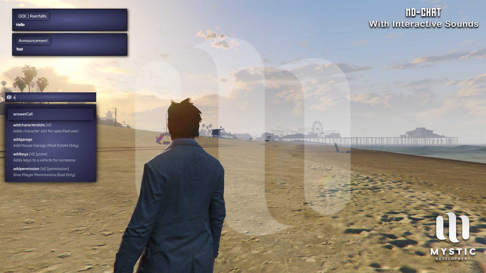

# Chat Script for FiveM (QBCore Framework)

---
- A clean and interactive chat script for FiveM servers using the QBCore framework. This script features a modern, polished UI and interactive typing sounds for an immersive in-game communication experience.
---



---

## ✨ Features
- **Sleek UI**: A visually appealing and user-friendly chat interface.
- **Interactive Sounds**: Realistic typing sounds enhance user engagement.
- **Easy Installation**: Drag-and-drop setup for seamless integration.

---

## 📦 Installation

### Step 1: Download and Add to Resources
1. Download the chat script from this repository.
2. Drag and drop the script folder into your server's `resources` directory.

### Step 2: Remove Default Chat Script
1. Navigate to:  
   `\resources\[cfx-default]\[gameplay]`
2. Delete the existing `chat` folder.

### Step 3: Add to `server.cfg`
1. Open your server configuration file (`server.cfg`).
2. Add the following line to ensure the script starts:

   ```
   ensure md-chat
   ```

---

### 🌐 Join Our Community
For support, updates, and more scripts, join our Discord server: <br>
[Mystic Development Discord](https://discord.gg/hd5pNVmZTu)

---

### 📝 License
This project is licensed under the GNU AGPL.

---

 ### Made with ❤️ by Mystic Development.